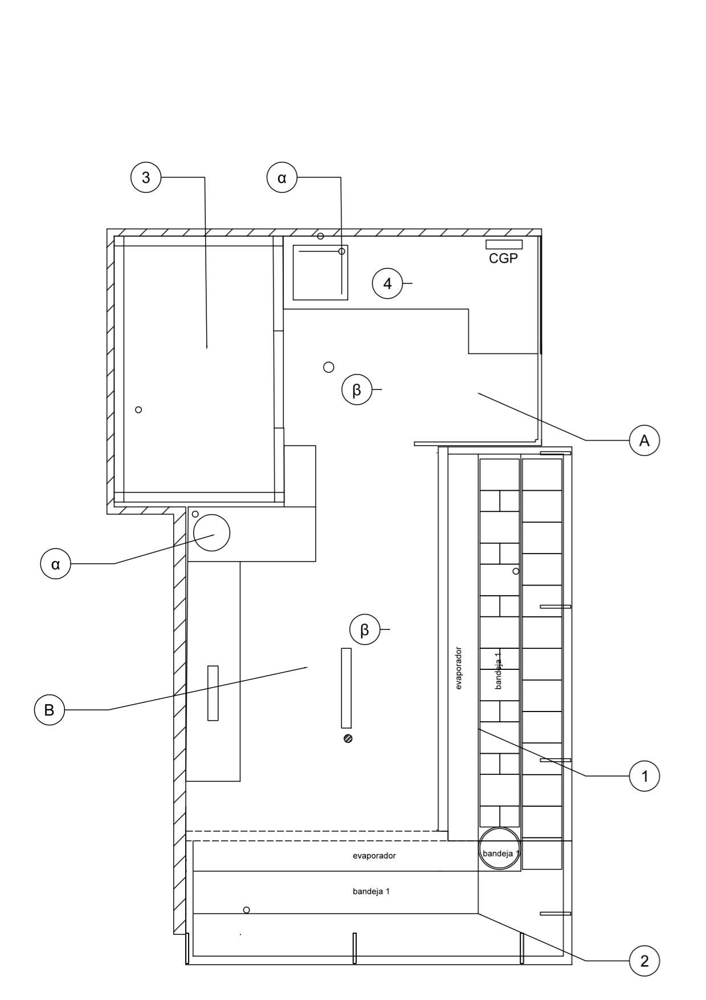

# Descripción de la actividad de la empresa

---

{{ nc }} es una empresa de carácter privado, en la cual se llevan a cabo actividades de recepción de materias primas y productos, conservas vegetales y de pescado, manipulación, aderezo y venta. Dicha actividad comienza con la recepción de materias primas y productos y finaliza con la venta al consumidor final, pasando por todas las fases pertinentes de transformación.

## Plano de planta del establecimiento
Se distinguen dos areas de trabajo dentro del establecimiento.

### Zona A: Area de Elaboración y Almacén de productos.
Zona destinada al almacenamiento de materias primas y la elaboración de productos finales para la venta al consumidor final. Los principales elementos a destacar en el plano de planta  son los siguientes:

* **3** Camara de conservación. Se almacenan los productos finales para su posterior venta. Temperatura de 3º.
* **4** Zona de elaboración de productos finales. bajo la encimera se encuentra también un pequeño congelador capaz de congelar productos hasta -24ºC (4 estrellas) utilizado principalmente para la congelación de boquerones y un pequeño almacén de materias primas para el aderezo de encurtidos.
* Fregadero con grifo de codo (*alpha*).
* Sumidero (*Beta*).

### Zona B: Area de Venta
Zona destinada a la venta del producto al consumidor final. Los principales elementos a destacar en el plano de planta  son los siguientes:

* Vitrinas expositoras regrigeradas. (1 y 2)
   * La vitrina **1** esta orientada a la venta de encurtidos y pescados escabechados a una temperatura de conservación de 6º.
   * La vitrina **2** se dedica a la venta de bacalao salado con una temperatura de conservación de 2º.
* Lavabo de manos con grifo automático electromecanico (*alpha*)
* Sumidero de Rejilla (*Beta*).
