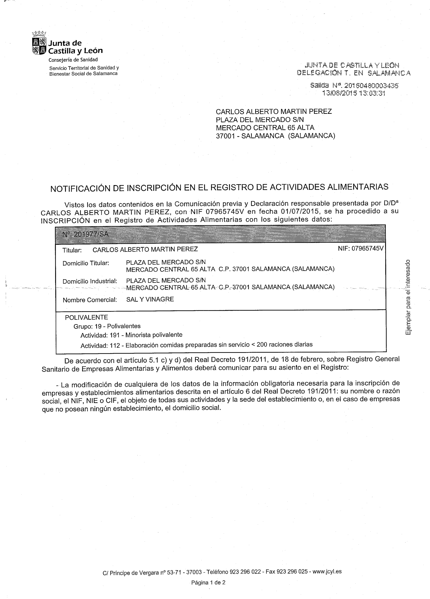
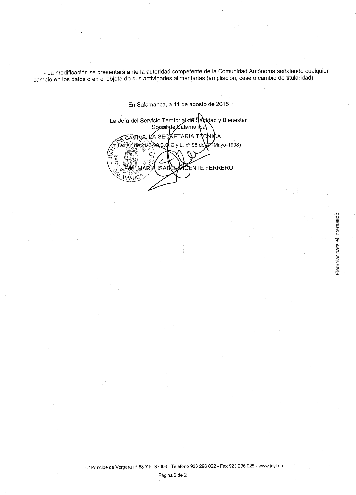

# Generalidades

---

* **Razón Social**: {{ rs }}
* **NIF**: {{ nif }}
* **Nombre Comercial**: {{ nc }}
* **Dirección**: {{ address }}
* **RAAL**:  {{ raal }}
* **Actividad Alimentaria**: {{ actividad }}. En la atualidad no desarrolla la actividad 112/Elaboración de comidas preparadas.

## Authorización Sanitaria

## Responsables de la aplicación del Sistema de Autocontrol

{{ rs }}, será la persona encargada de la cumplimentación de todos los registros y documentos que se generen en el manual.

## Ámbito de aplicación del sistema de autocontrol y seguimiento

El sistema de autocontrol va dirigido a la recepción de materias primas y productos alimenticios, manipulación y elaboración de los mismos y servicio a un colectivo de consumidores finales.
El sistema será implantado y existirá un compromiso de realizar un seguimiento de dicho sistema, siendo revisado y actualizado de manera continua según vayan existiendo cambios en cualquiera de los capítulos, de manera que sea un sistema dinámico.
